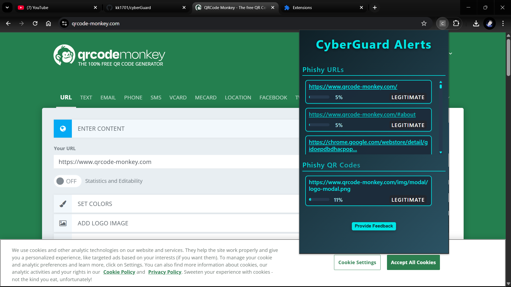

# 🛡️ CyberGuard – Fraud Detection Extension

_“Because clicking on the wrong link shouldn’t cost you your sanity.”_

Welcome to **CyberGuard**, a supercharged Chrome Extension that detects shady URLs and evil QR codes faster than you can say "phishing scam."

---

## 🕵️‍♂️ What is this sorcery?

CyberGuard is a **fraud detection extension** for Chrome that:
- 🧠 Uses **machine learning** to sniff out phishing links like a sniffer dog at an airport.
- 👁️ Uses **computer vision** (yup, we trained a CNN!) to spot malicious QR codes. No more surprise malware when you scan that “free coffee” poster.
- 💻 Comes with a stylish **admin dashboard** because we like our security with a side of elegance.

---

## 💡 Why did we build this?

Because every time someone falls for a “You've won an iPhone” message, a developer cries.

Also:
- 🚫 Phishing links are everywhere.
- 📸 QR codes are the new trojan horses.
- 🧑‍💻 We like building cool things with AI, ML, FastAPI, MongoDB, and React.
- ✅ And because we could.

---

## 🧠 Under the Hood

### 🧩 Two models, double the power:
- **URL Model**: An **ensemble voting classifier** (Logistic Regression + Random Forest + Gradient Boosting). Hosted via FastAPI because Flask was feeling lazy.
- **QR Model**: A **CNN** that eats 128×128 QR images for breakfast and spits out verdicts (malicious or not).

### 🧠 Tech Stack (aka The Stuff That Makes It Work™):
| Layer        | Tech Used                     |
|--------------|-------------------------------|
| Frontend     | React.js, Chrome Extension APIs |
| Backend      | FastAPI, MongoDB              |
| ML Models    | TensorFlow, scikit-learn, OpenCV |
| Dev Tools    |  Git, VS Code, Pycharm |
| Bonus Swag   | Admin Dashboard + Swanky UI ✨ |

---


### 📸 Screenshots

Here are some screenshots of CyberGuard in action:

<p align="center">
  
  <br/>
  <em>1. Extension scanning the web page for suspicious URLs and QR codes.</em>
  <br/><br/>
  
  <br/>
  <em>2. Extension displaying detected phishing URLs and QR codes.</em>
  <br/><br/>
  
  <br/>
  <em>3. Feedback form to report false positive predictions.</em>
  <br/><br/>
  
  <br/>
  <em>4. Login page of the admin dashboard.</em>
  <br/><br/>
  
  <br/>
  <em>5. Admin dashboard for monitoring and managing predictions.</em>
</p>

---

## 🚀 How to run this beast

> _Warning: May detect your own code as suspicious. It’s that good._

### 1. Clone the repo  
   ```bash
   git clone https://github.com/kk1701/cyberGuard
   cd cyberGuard
   ```
### 2. Start the backend (FastAPI with uvicorn)
```
cd backend
pip install -r requirements.txt
uvicorn main:app --reload
```

### 3. Start the frontend (React app)
```
cd admin-dashboard
npm install
npm run start
```

## 🧩 Load the Extension in Chrome

1. Create a build of the extension using:
   ```bash
    npm run build
   ```
2. In the `cyberGuard-extension/dist` folder import compiled CSS file in `popup.html` and `options.html` as shown below.
  ```
    <link rel="stylesheet" href="./assets/style.BOsXGunn.css">
  ```
3. Update JS import source from `main.js` to `popup.js` and `options.js` in `popup.html` and `options.html` respectively.
3. Go to `chrome://extensions/`
4. Enable **Developer Mode** (top right)
5. Click **Load unpacked** → select the `cyberGuard-extension/dist` folder
6. Be proud of yourself. You’ve just become immune to 90% of internet scams. 🧠

---

## 🧪 Testing It (a.k.a. Trying to Break It)

- Feed it malicious URLs like `http://totallynotaphishing.site/free-money`  
  _(don’t actually click them)_
- Scan shady QR codes from posters, emails, or dark corners of the internet.
- Report false positives like a responsible netizen.

---

## 🙏 Special Thanks

- To every Nigerian prince who inspired us to write this project. 💸  
- And to our laptops — for not catching fire during CNN training. 🔥🧠

---

## 📬 Contact

Built with ☕ and way too many sleepless nights by [@Lightinw](https://github.com/Lightinw), [@kk1701](https://github.com/kk1701), [@shashigurjar](https://github.com/shashigurjar), [@kalpitgnagar](https://github.com/kalpitgnagar).

---

## 📜 License

MIT – Because open-source makes the world go ‘round.

> _P.S. If this extension prevents just one person from clicking on a scam link, we’ve done our job._


